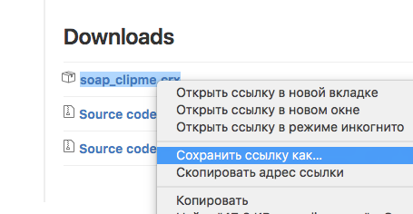
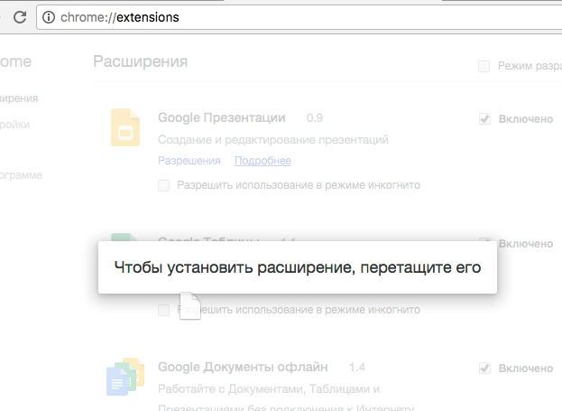
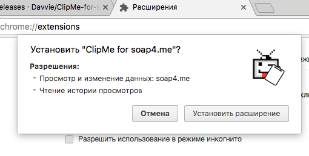

# ClipMe for soap4.me
Это неофициальное расширение для Chrome добавляет кнопку копирования прямой ссылки в список серий на soap4.me.

## Установка

1. Скачайте [последнюю версию расширения](https://github.com/Davvie/ClipMe-for-soap/releases). Для этого нажмите по названию файла (soap_clipme.crx) правой кнопкой и выберите "Сохранить ссылку как".

2. Откройте "Расширения". Перетащите скачанный файл в окно браузера.

3. Убедитесь, что ничего плохого расширение не делает и нажмите "Установить расширение" :)

